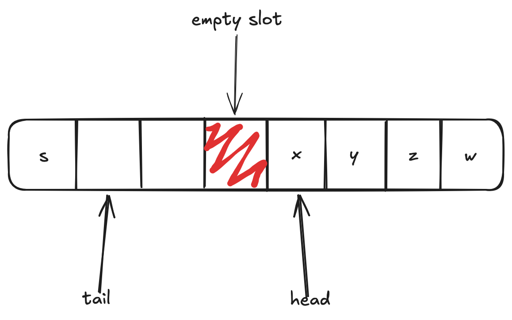
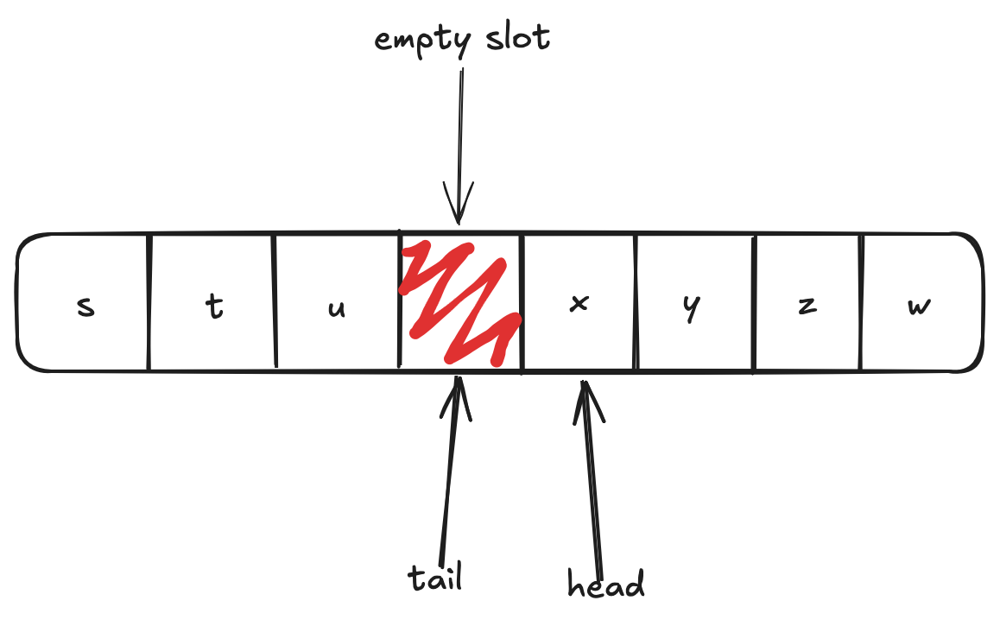

# Lock-Free SPSC Ring Buffer

This is a simple implementation of a ring buffer that is single-producer single-consumer and lock-free.

# API

The ring buffer is generic, and so necessitates initialization with a `size_t elt_size` to tell it how big the elements are. Initialization works as follows:

```c
ring_buffer_init(&rb, capacity, elt_size);
```

Symmetrically, deinitialization is simply:

```c
ring_buffer_deinit(&rb);
```

To push a value in `x` into the buffer:

```c
ring_buffer_push(&rb, &x);
```

And to pop a value into a variable `x`, one does:

```c
ring_buffer_pop(&rb, &x);
```

There is also a resizing operation; a "private" version prefixed with a `_` exists that also unconditionally resets the head and tail exists, but is more useful for testing purposes in `test.c`. The "public" version resets the head and tail only if the new capacity is smaller than the previous one:

```c
ring_buffer_resize(&rb, capacity);
```

All of these function return `0` on success, and `-1` on any error. To enable debugging messages, make sure to `#define DEBUG` in `ring_buffer.c`.

# Layout of Ring Buffer

Ring buffers need some way to determine its empty/full status. This becomes apparent if one just sets `head = tail = 0` and starts pushing some elements into the buffer: what does `head == tail` mean? At initialization, `head == tail == 0`, and so it is empty. But once we've filled the buffer, `tail` has reached around to `head`, so `head == tail` but the buffer is full. One simple approach is to reserve an empty slot so that when `head == tail` the buffer is empty, and when `(tail + 1) % capacity == head` the buffer is full. Since our ring buffer is generic, we do not waste the amount of bytes in `elt_size`, but simply one byte. At all times we have this unused byte in order to detected empty/full status.

The following picture shows an idealized layout of our ring buffer implementation. There are 5 elements in the buffer; `tail` points to the next available slot. Note that `empty slot` is reserved for empty/full status checking. 



After having pushed two more elements into the buffer, `tail` points to the reserved slot. By now `(tail + 1) % capacity == head`, and thus the buffer is full. 



Note that this is an idealized layout, and that our generic implementation does not use `elt_size` bytes for the reserved slot (unless `elt_size == sizeof(uint8_t)`).

# Concurrency Considerations

## Atomicity

We have the following sharing of members in `ring_buffer_t`:

- `head` is read in `push` and read-write in `pop`,
- `tail` is read in `pop` and read-write in `push`,
- `data` is read in `pop` and write in `push`.

Without synchronization, this is undefined behavior; the compiler may reorder critical sequences in the code. A strong memory model, as in x86, might make this behave. Even if the CPU's memory model would execute things "safely", a concurrent data race in C is undefined behavior according to the standard. On weakly-ordered memory architectures (e.g. ARM), this manifests more easily; on x86, it might appear to work.

This ring buffer is lock-free, and so we use atomics from `<stdatomic.h>`. In particular, we want to uphold the following invariants:

- In `pop`, when the buffer is not empty, we want the last write to `data` corresponding to the last increment of `tail` to have occurred,
- In `push`, when the buffer is not full, we want the last read from `data` corresponding to the last increment of `head` to have occurred.

For the first, we want that the `memcpy` in `push` is visible as soon as we have updated the `tail`; thus we use the `release` memory order to perform this write to `tail`. There is the symmetric `acquire` read in `pop` of `tail` to force this synchronization.

Similarly, we want the `memcpy` in `pop` to be visible as soon as we have updated the `head`; thus we use the `release` memory order again. The `acquire` read in `push` of `head` makes sure that the increment of `head` ensures the popped memory already having been read, so that `push` doesn't overwrite `data` at `head` before it can be safely read by `pop`.

All other atomic loads use a `relaxed` memory ordering; for example, since `tail` is read-write in `push`, the initial load of it is `relaxed`. Similarly in `pop`, because `head` is read-write there, its initial load is also `relaxed`. These are safe because the later `release` writes enforce the correct ordering, so that each respective thread sees the data correctly.

## False Sharing

To avoid false sharing of `head` and `tail`, we use a GNU/Clang extension to align those fields to reside on different cache lines. This necessitates knowing the cache line size (can use `getconf` or `sysconf` for example) and `#define CACHE_LINE_SIZE ?` in `ring_buffer.h`.

# Tests

There are tests that check the consistency of the `push` and `pop` operations. To further stress the robustness of the implementation we use randomized yields to make sure the order of reads/writes is as expected.

# Dynamic Analysis

The `Makefile` compiles the files with `fsanitize=undefined,thread` in order to use TSan at runtime to detect data races. In fact, during development this has uncovered bugs and now runs the tests without issues. Furthermore, `valgrind` is used to make sure no errors related to memory occur. Note that these two tools cannot uncover bugs in the atomicity of operations. Thus we have other tests as already mentioned.

# Building

To use the ring buffer in a separate project, one would simply copy over `ring_buffer.{c,h}` to the project directory. Here, the building and running is done for the tests. Having adjusted the cache line size in `ring_buffer.h`, simply run the following:

```
$ make && ./test
```

To run valgrind one can run:

```
$ make valgrind
```
